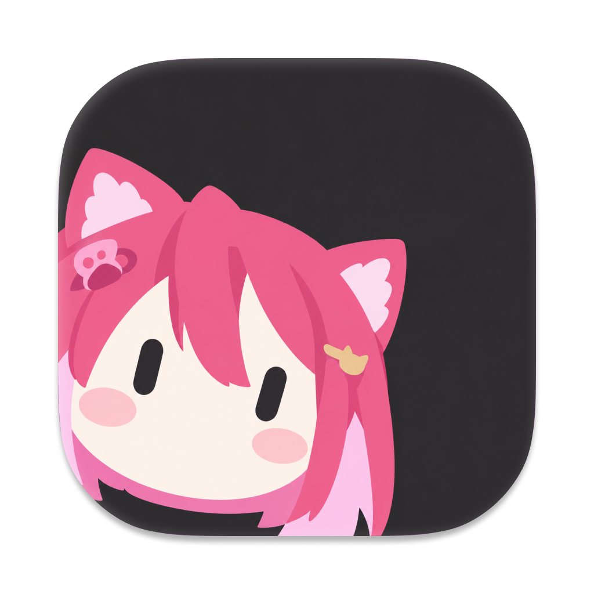

**English** | [한국어](README_ko.md)

<h1 align="center">NekoPlayer</h1>
<p align="center"></p>
<p align="center">A new era of YouTube Video Player with a focus on design and creativity.</p>
<p align="center">Some resources(samples) in this app are using <a href="https://github.com/ppy/osu-resources">ppy/osu-resources</a>.</p>

<p align="center">
<a href="https://github.com/ZeroMayo/ZeroMayo/blob/main/docs/project-status.md"></a>
<a href="https://github.com/ZeroMayo/NekoPlayer/actions/workflows/ci.yml"></a>
<a href="https://github.com/ZeroMayo/NekoPlayer/releases/latest"></a>

<a href="https://github.com/ZeroMayo/NekoPlayer/blob/master/LICENSE.md"></a>
<a href="https://discord.gg/UZWDqQ29ch"></a>
<a href="https://www.codefactor.io/repository/github/ZeroMayo/NekoPlayer"></a>
</p>

## Downloading and installing the app

### Latest release:

| [Windows 10+ (x64)](https://github.com/ZeroMayo/NekoPlayer/releases/latest/download/NekoPlayer-win-Setup.exe) |
|--------------------------------------------------------------------------------------|

The YouTube API Daily Quota fills up very fast (Google has a hard limit of 10,000 units). Please do not ask about this.

## Developing NekoPlayer

### Prerequisites

Please make sure you have the following prerequisites:

- A desktop platform with the [.NET 10.0 SDK](https://dotnet.microsoft.com/download) installed.
- When running on linux, please have a system-wide ffmpeg installation available to support video decoding.

When working with the codebase, we recommend using an IDE with intelligent code completion and syntax highlighting, such as the latest version of [Visual Studio](https://visualstudio.microsoft.com/vs/), [Visual Studio Code](https://code.visualstudio.com/) with the [EditorConfig](https://marketplace.visualstudio.com/items?itemName=EditorConfig.EditorConfig) and [C# Dev Kit](https://marketplace.visualstudio.com/items?itemName=ms-dotnettools.csdevkit) plugin installed.

### Downloading the source code

Clone the repository including submodules:

```shell
git clone --recurse-submodules https://github.com/ZeroMayo/NekoPlayer
cd NekoPlayer
```

To update the source code to the latest commit, run the following command inside the `NekoPlayer` directory:

```shell
git pull --recurse-submodules
```

### Building

#### From an IDE

You should load the solution via one of the platform-specific `.slnf` files, rather than the main `.sln`. This will reduce dependencies and hide platforms that you don't care about. Valid `.slnf` files are:

- `NekoPlayer.Desktop.Windows.slnf` (Windows platform with WinRT extensions, most common)
- `NekoPlayer.Desktop.slnf` (Linux and other platform)

Run configurations for the recommended IDEs (listed above) are included. You should use the provided Build/Run functionality of your IDE to get things going. When testing or building new components, it's highly encouraged you use the `NekoPlayer (Tests)` project/configuration. More information on this is provided [below](#contributing).

#### From CLI

You can also build and run *NekoPlayer* from the command-line with a single command:

```shell
dotnet run --project NekoPlayer.Desktop.Windows (for Windows)
dotnet run --project NekoPlayer.Desktop (for Linux and other platform)
```

When running locally to do any kind of performance testing, make sure to add `-c Release` to the build command, as the overhead of running with the default `Debug` configuration can be large (especially when testing with local framework modifications as below).

If the build fails, try to restore NuGet packages with `dotnet restore`.

## Contributing

When it comes to contributing to the project, the two main things you can do to help out are reporting issues and submitting pull requests. Please refer to the [contributing guidelines](CONTRIBUTING.md) to understand how to help in the most effective way possible.

## Licence

*NekoPlayer*'s codes are licensed under the [MIT licence](https://opensource.org/licenses/MIT). Please see [the licence file](LICENCE) for more information. [tl;dr](https://tldrlegal.com/license/mit-license) you can do whatever you want as long as you include the original copyright and license notice in any copy of the software/source.

**Note:** FFmpeg binaries are distributed under their original licenses (GPL/LGPL) from the source.
Please refer to [FFmpeg License](https://www.ffmpeg.org/legal.html) for details.

Please also note that app resources are covered by a separate licence. Please see [the licence file](https://github.com/ZeroMayo/NekoPlayer/blob/master/NekoPlayer.App.Resources/LICENSE.md) for more information.

## Star History

<a href="https://www.star-history.com/?repos=ZeroMayo%2FNekoPlayer&type=date&legend=top-left">
 <picture>
   <source media="(prefers-color-scheme: dark)" srcset="https://api.star-history.com/image?repos=ZeroMayo/NekoPlayer&type=date&theme=dark&legend=top-left" />
   <source media="(prefers-color-scheme: light)" srcset="https://api.star-history.com/image?repos=ZeroMayo/NekoPlayer&type=date&legend=top-left" />
   
 </picture>
</a>